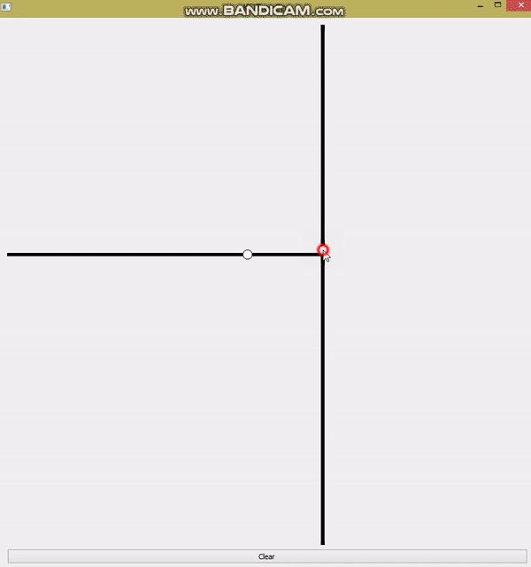

# KDTree_with_visualisation
This C++ Qt code provides GUI to play with 2D K-D trees.

Each time you click left mouse button new node is added and tree is rebuild to maintain balance. 
When right mouse button pressed nearest neighbor node search is performed. 

Nearest to mouse click point node is marked red. All subtrees that were dropped during nearest neighbor search are highlighted by cyan color. Such visualisation allows examination of the way K-D tree performance in different situations.

